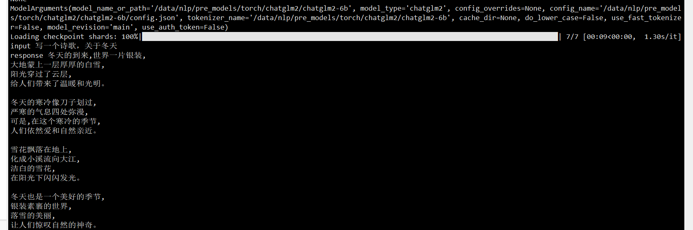
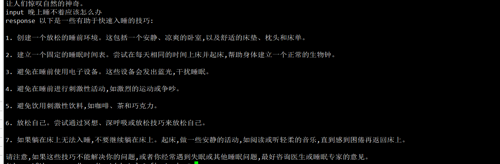

##  statement
- [deep_training](https://github.com/ssbuild/deep_training)

```text
    dev 分支加一些新功能和想法 如果求稳定，请使用 stable分支
    07-18 微调经验分享见: https://github.com/ssbuild/aigc_zoo#训练经验分享
    07-16 modify data strategy
    07-04 support ptv2 and arrow_stream,arrow_file,parquet dataset
```
   


## install
  - pip install -U -r requirements.txt
  - 如果无法安装 , 可以切换官方源 pip install -i https://pypi.org/simple -U -r requirements.txt  

```text
dev 通过一下方式安装
pip install -U git+https://github.com/ssbuild/deep_training.git
pip install -U transformers>=4.30 deepspeed xformers bitsandbytes>=0.39 accelerate>=0.20
```


## weight

- [chatglm2-6b](https://huggingface.co/THUDM/chatglm2-6b)   支持四种微调方式
- [chatglm2-6b-int4](https://huggingface.co/THUDM/chatglm2-6b-int4)  ptv2
- [chatglm2-6b-32k](https://huggingface.co/THUDM/chatglm2-6b-32k)   支持四种微调方式
- [chatglm2-6b-32k-int4](https://huggingface.co/ssbuild/chatglm2-6b-32k-int4/tree/main)  ptv2


## data sample
   第三方羊驼数据 https://github.com/hikariming/alpaca_chinese_dataset
    单条数据示例
```json
 {
     "id": 0, "paragraph": [
         {
             "q": "从南京到上海的路线",
             "a":  "你好，南京到上海的路线如下：1. 南京到上海，可以乘坐南京地铁1号线，在南京站乘坐轨道交通1号线。2. 南京到浦东机场，可以搭乘上海地铁1号，在陆家嘴站乘坐地铁1线，在浦东国际机场站乘坐机场快线，前往上海浦东国际机场。3. 上海到南京，可以换乘上海地铁2号线，从南京站换乘地铁2线，再从南京南站换乘地铁1路，然后到达上海站"
         }
     ]
 }
```

   多轮会话
```json
 {
     "id": 0, "paragraph": [
        {
           "q": "你好",
           "a": "我是机器人，有什么可以帮助你的？"
        },
         {
             "q": "从南京到上海的路线",
             "a":  "你好，南京到上海的路线如下：1. 南京到上海，可以乘坐南京地铁1号线，在南京站乘坐轨道交通1号线。2. 南京到浦东机场，可以搭乘上海地铁1号，在陆家嘴站乘坐地铁1线，在浦东国际机场站乘坐机场快线，前往上海浦东国际机场。3. 上海到南京，可以换乘上海地铁2号线，从南京站换乘地铁2线，再从南京南站换乘地铁1路，然后到达上海站"
         }
     ]
 }

```


## infer
    # infer.py 推理预训练模型
    # infer_finetuning.py 推理微调模型
    # infer_lora_finetuning.py 推理lora微调模型
     python infer.py


| **量化等级**    | **最低 GPU 显存** |
| -------------- | ----------------- |
| FP16（无量化）   | 13 GB             |
| INT8           | 10 GB              |
| INT4           | 6 GB               |

   





## training
```text
    制作数据
    python data_utils.py
    注: num_process_worker 为多进程制作数据 ， 如果数据量较大 ， 适当调大至cpu数量
    dataHelper.make_dataset_with_args(data_args.train_file,mixed_data=False, shuffle=True,mode='train',num_process_worker=0)
    
    训练
    python train.py
```

## 训练参数
[训练参数](args.MD)


## 友情链接

- [pytorch-task-example](https://github.com/ssbuild/pytorch-task-example)
- [tf-task-example](https://github.com/ssbuild/tf-task-example)
- [chatmoss_finetuning](https://github.com/ssbuild/chatmoss_finetuning)
- [chatglm_finetuning](https://github.com/ssbuild/chatglm_finetuning)
- [chatyuan_finetuning](https://github.com/ssbuild/chatyuan_finetuning)
- [llm_finetuning](https://github.com/ssbuild/llm_finetuning)
- [rlhf_llm](https://github.com/ssbuild/rlhf_llm)
- [rlhf_chatglm](https://github.com/ssbuild/rlhf_chatglm)
- [rlhf_chatyuan](https://github.com/ssbuild/rlhf_chatyuan)
- [rwkv_finetuning](https://github.com/ssbuild/rwkv_finetuning)


## 
    纯粹而干净的代码


    

## Reference
    https://huggingface.co/THUDM/chatglm2-6b


## Star History

[](https://star-history.com/#ssbuild/chatglm2_finetuning&Date)

